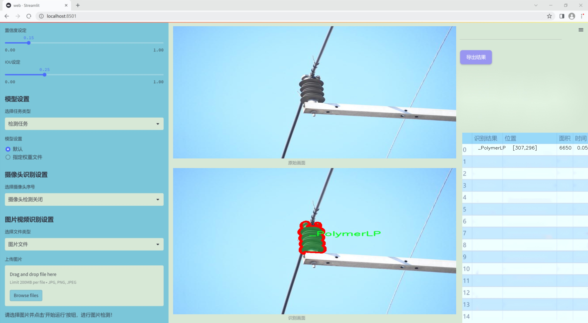
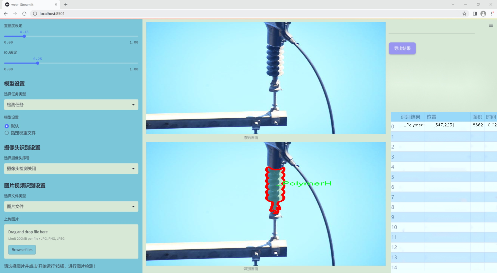
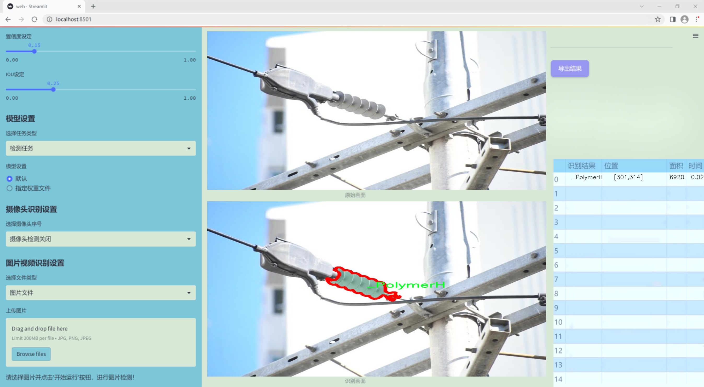
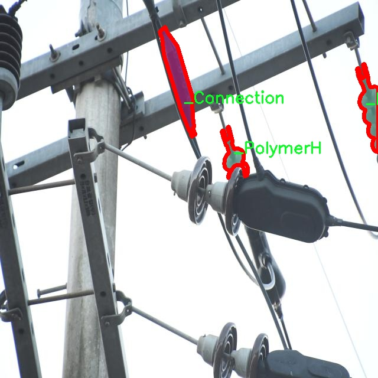
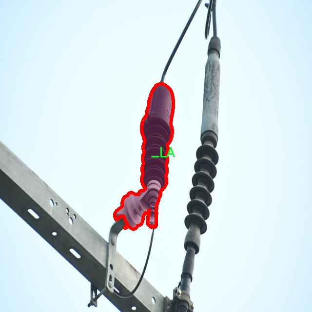
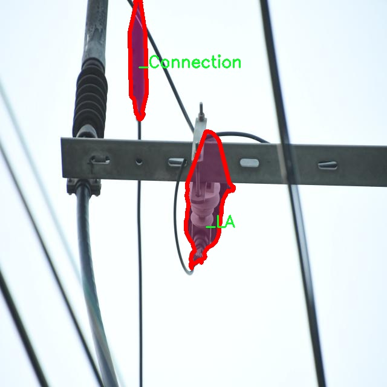
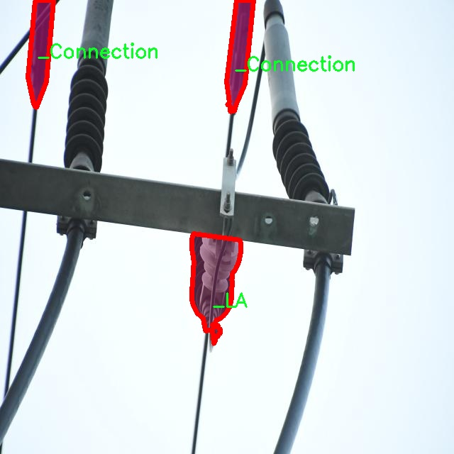

### 1.背景意义

研究背景与意义

随着电力行业的快速发展，电力设备的安全性和可靠性变得愈发重要。电力设备在日常运行中容易受到环境因素、老化、机械损伤等多种因素的影响，导致设备缺陷的产生。这些缺陷不仅会影响电力的正常供应，还可能引发安全事故，造成严重的经济损失和人员伤亡。因此，及时、准确地检测电力设备的缺陷，成为了电力行业亟待解决的关键问题。

传统的电力设备缺陷检测方法多依赖人工巡检，这种方式不仅效率低下，而且容易受到人为因素的影响，导致漏检和误检的情况发生。近年来，随着计算机视觉技术的迅猛发展，基于深度学习的自动化检测系统逐渐成为研究的热点。YOLO（You Only Look Once）系列模型因其高效的实时检测能力和良好的准确性，广泛应用于物体检测任务中。然而，现有的YOLO模型在电力设备缺陷检测中的应用仍存在一定的局限性，如对复杂背景的适应性不足、对小目标的检测精度不高等问题。

本研究旨在基于改进的YOLOv11模型，构建一个高效的电力设备缺陷检测系统。该系统将利用包含1100张图像的poletesttest数据集，涵盖了五个类别的电力设备缺陷，如连接缺陷、绝缘子缺陷等。通过对数据集的深入分析和模型的优化，期望提升系统在实际应用中的检测准确率和鲁棒性。此研究不仅为电力设备的智能化管理提供了技术支持，也为相关领域的研究提供了新的思路和方法，具有重要的理论价值和实际意义。

### 2.视频效果

[2.1 视频效果](https://www.bilibili.com/video/BV1pikgY7E1v/)

### 3.图片效果







##### [项目涉及的源码数据来源链接](https://kdocs.cn/l/cszuIiCKVNis)**

注意：本项目提供训练的数据集和训练教程,由于版本持续更新,暂不提供权重文件（best.pt）,请按照6.训练教程进行训练后实现上图演示的效果。

### 4.数据集信息

##### 4.1 本项目数据集类别数＆类别名

nc: 5
names: ['_Connection', '_LA', '_PolymerH', '_PolymerLP', '_TR']


该项目为【图像分割】数据集，请在【训练教程和Web端加载模型教程（第三步）】这一步的时候按照【图像分割】部分的教程来训练

##### 4.2 本项目数据集信息介绍

本项目数据集信息介绍

本项目所使用的数据集旨在为改进YOLOv11的电力设备缺陷检测系统提供强有力的支持。该数据集名为“poletesttest”，专注于电力设备的多种缺陷类型，涵盖了五个主要类别。这些类别分别是：连接缺陷（_Connection）、绝缘子缺陷（_LA）、聚合物材料缺陷（_PolymerH）、聚合物低压缺陷（_PolymerLP）以及变压器缺陷（_TR）。通过对这些类别的详细标注和分类，我们能够更好地训练深度学习模型，以实现高效、准确的缺陷检测。

在数据集的构建过程中，我们采用了多种数据采集技术，包括现场拍摄和模拟数据生成，确保数据的多样性和代表性。每个类别的样本数量经过精心设计，以保证模型在训练过程中能够充分学习到每种缺陷的特征。数据集中包含的图像涵盖了不同的拍摄角度、光照条件和背景环境，旨在提高模型的鲁棒性和适应性。

此外，为了提升模型的泛化能力，我们还对数据集进行了数据增强处理，包括旋转、缩放、裁剪和颜色变换等操作。这些处理不仅增加了样本的多样性，还有效地防止了模型的过拟合现象。通过对“poletesttest”数据集的深入分析和处理，我们期望能够为电力设备的缺陷检测提供一个全面、准确的解决方案，从而提高电力设备的安全性和可靠性。最终，经过训练的YOLOv11模型将能够在实际应用中快速、准确地识别和定位电力设备的各种缺陷，为电力行业的维护和管理提供有力的技术支持。










### 5.全套项目环境部署视频教程（零基础手把手教学）

[5.1 所需软件PyCharm和Anaconda安装教程（第一步）](https://www.bilibili.com/video/BV1BoC1YCEKi/?spm_id_from=333.999.0.0&vd_source=bc9aec86d164b67a7004b996143742dc)


[5.2 安装Python虚拟环境创建和依赖库安装视频教程（第二步）](https://www.bilibili.com/video/BV1ZoC1YCEBw?spm_id_from=333.788.videopod.sections&vd_source=bc9aec86d164b67a7004b996143742dc)

### 6.改进YOLOv11训练教程和Web_UI前端加载模型教程（零基础手把手教学）

[6.1 改进YOLOv11训练教程和Web_UI前端加载模型教程（第三步）](https://www.bilibili.com/video/BV1BoC1YCEhR?spm_id_from=333.788.videopod.sections&vd_source=bc9aec86d164b67a7004b996143742dc)


按照上面的训练视频教程链接加载项目提供的数据集，运行train.py即可开始训练



     Epoch   gpu_mem       box       obj       cls    labels  img_size
     1/200     20.8G   0.01576   0.01955  0.007536        22      1280: 100%|██████████| 849/849 [14:42<00:00,  1.04s/it]
               Class     Images     Labels          P          R     mAP@.5 mAP@.5:.95: 100%|██████████| 213/213 [01:14<00:00,  2.87it/s]
                 all       3395      17314      0.994      0.957      0.0957      0.0843

     Epoch   gpu_mem       box       obj       cls    labels  img_size
     2/200     20.8G   0.01578   0.01923  0.007006        22      1280: 100%|██████████| 849/849 [14:44<00:00,  1.04s/it]
               Class     Images     Labels          P          R     mAP@.5 mAP@.5:.95: 100%|██████████| 213/213 [01:12<00:00,  2.95it/s]
                 all       3395      17314      0.996      0.956      0.0957      0.0845

     Epoch   gpu_mem       box       obj       cls    labels  img_size
     3/200     20.8G   0.01561    0.0191  0.006895        27      1280: 100%|██████████| 849/849 [10:56<00:00,  1.29it/s]
               Class     Images     Labels          P          R     mAP@.5 mAP@.5:.95: 100%|███████   | 187/213 [00:52<00:00,  4.04it/s]
                 all       3395      17314      0.996      0.957      0.0957      0.0845


###### [项目数据集下载链接](https://kdocs.cn/l/cszuIiCKVNis)

### 7.原始YOLOv11算法讲解


ultralytics发布了最新的作品YOLOv11，这一次YOLOv11的变化相对于ultralytics公司的上一代作品YOLOv8变化不是很大的（YOLOv9、YOLOv10均不是ultralytics公司作品），其中改变的位置涉及到C2f变为C3K2，在SPPF后面加了一层类似于注意力机制的C2PSA，还有一个变化大家从yaml文件是看不出来的就是它的检测头内部替换了两个DWConv，以及模型的深度和宽度参数进行了大幅度调整，但是在损失函数方面就没有变化还是采用的CIoU作为边界框回归损失，下面带大家深入理解一下ultralytics最新作品YOLOv11的创新点。

**下图为最近的YOLO系列发布时间线！**


* * *

###### YOLOv11和YOLOv8对比

在YOLOYOLOv5，YOLOv8，和YOLOv11是ultralytics公司作品（ultralytics出品必属精品），下面用一张图片从yaml文件来带大家对比一下YOLOv8和YOLOv11的区别，配置文件变得内容比较少大家可以看一卡，左侧为YOLOv8右侧为YOLOv11，不同的点我用黑线标注了出来。


* * *

###### YOLOv11的网络结构解析

下面的图片为YOLOv11的网络结构图。


**其中主要创新点可以总结如下- > **

* * *

1\.
提出C3k2机制，其中C3k2有参数为c3k，其中在网络的浅层c3k设置为False（下图中可以看到c3k2第二个参数被设置为False，就是对应的c3k参数）。


此时所谓的C3k2就相当于YOLOv8中的C2f，其网络结构为一致的，其中的C3k机制的网络结构图如下图所示
**（为什么叫C3k2，我个人理解是因为C3k的调用时C3k其中的参数N固定设置为2的原因，个人理解不一定对** ）。


* * *

2\.
第二个创新点是提出C2PSA机制，这是一个C2（C2f的前身）机制内部嵌入了一个多头注意力机制，在这个过程中我还发现作者尝试了C2fPSA机制但是估计效果不如C2PSA，有的时候机制有没有效果理论上真的很难解释通，下图为C2PSA机制的原理图，仔细观察把Attention哪里去掉则C2PSA机制就变为了C2所以我上面说C2PSA就是C2里面嵌入了一个PSA机制。


* * *

3\.
第三个创新点可以说是原先的解耦头中的分类检测头增加了两个DWConv，具体的对比大家可以看下面两个图下面的是YOLOv11的解耦头，上面的是YOLOv8的解耦头.


我们上面看到了在分类检测头中YOLOv11插入了两个DWConv这样的做法可以大幅度减少参数量和计算量（原先两个普通的Conv大家要注意到卷积和是由3变为了1的，这是形成了两个深度可分离Conv），大家可能不太理解为什么加入了两个DWConv还能够减少计算量，以及什么是深度可分离Conv，下面我来解释一下。

> **`DWConv` 代表 Depthwise
> Convolution（深度卷积）**，是一种在卷积神经网络中常用的高效卷积操作。它主要用于减少计算复杂度和参数量，尤其在移动端或轻量化网络（如
> MobileNet）中十分常见。
>
> **1\. 标准卷积的计算过程**
>
> 在标准卷积操作中，对于一个输入张量（通常是一个多通道的特征图），卷积核的尺寸是 `(h, w, C_in)`，其中 `h` 和 `w`
> 是卷积核的空间尺寸，`C_in`
> 是输入通道的数量。而卷积核与输入张量做的是完整的卷积运算，每个输出通道都与所有输入通道相连并参与卷积操作，导致计算量比较大。
>
> 标准卷积的计算过程是这样的：
>
>   * 每个输出通道是所有输入通道的组合（加权求和），卷积核在每个位置都会计算与所有输入通道的点积。
>   * 假设有 `C_in` 个输入通道和 `C_out` 个输出通道，那么卷积核的总参数量是 `C_in * C_out * h * w`。
>

>
> 2\. **Depthwise Convolution（DWConv）**
>
> 与标准卷积不同， **深度卷积** 将输入的每个通道单独处理，即 **每个通道都有自己的卷积核进行卷积**
> ，不与其他通道进行交互。它可以被看作是标准卷积的一部分，专注于空间维度上的卷积运算。
>
> **深度卷积的计算过程：**
>
>   * 假设输入张量有 `C_in` 个通道，每个通道会使用一个 `h × w`
> 的卷积核进行卷积操作。这个过程称为“深度卷积”，因为每个通道独立进行卷积运算。
>   * 输出的通道数与输入通道数一致，每个输出通道只和对应的输入通道进行卷积，没有跨通道的组合。
>   * 参数量和计算量相比标准卷积大大减少，卷积核的参数量是 `C_in * h * w`。
>

>
> **深度卷积的优点：**
>
>   1. **计算效率高** ：相对于标准卷积，深度卷积显著减少了计算量。它只处理空间维度上的卷积，不再处理通道间的卷积。
>   2.  **参数量减少** ：由于每个卷积核只对单个通道进行卷积，参数量大幅减少。例如，标准卷积的参数量为 `C_in * C_out * h *
> w`，而深度卷积的参数量为 `C_in * h * w`。
>   3.  **结合点卷积可提升效果** ：为了弥补深度卷积缺乏跨通道信息整合的问题，通常深度卷积后会配合 `1x1` 的点卷积（Pointwise
> Convolution）使用，通过 `1x1` 的卷积核整合跨通道的信息。这种组合被称为 **深度可分离卷积** （Depthwise
> Separable Convolution） | **这也是我们本文YOLOv11中的做法** 。
>

>
> 3\. **深度卷积与标准卷积的区别**
>
> 操作类型| 卷积核大小| 输入通道数| 输出通道数| 参数量  
> ---|---|---|---|---  
> 标准卷积| `h × w`| `C_in`| `C_out`| `C_in * C_out * h * w`  
> 深度卷积（DWConv）| `h × w`| `C_in`| `C_in`| `C_in * h * w`  
>  
> 可以看出，深度卷积在相同的卷积核大小下，参数量减少了约 `C_out` 倍
> （细心的人可以发现用最新版本的ultralytics仓库运行YOLOv8参数量相比于之前的YOLOv8以及大幅度减少了这就是因为检测头改了的原因但是名字还是Detect，所以如果你想继续用YOLOv8发表论文做实验那么不要更新最近的ultralytics仓库）。
>
> **4\. 深度可分离卷积 (Depthwise Separable Convolution)**
>
> 深度卷积常与 `1x1` 的点卷积配合使用，这称为深度可分离卷积。其过程如下：
>
>   1. 先对输入张量进行深度卷积，对每个通道独立进行空间卷积。
>   2. 然后通过 `1x1` 点卷积，对通道维度进行混合，整合不同通道的信息。
>

>
> 这样既可以保证计算量的减少，又可以保持跨通道的信息流动。
>
> 5\. **总结**
>
> `DWConv` 是一种高效的卷积方式，通过单独处理每个通道来减少计算量，结合 `1x1`
> 的点卷积，形成深度可分离卷积，可以在保持网络性能的同时极大地减少模型的计算复杂度和参数量。

**看到这里大家应该明白了为什么加入了两个DWConv还能减少参数量以及YOLOv11的检测头创新点在哪里。**

* * *

##### YOLOv11和YOLOv8还有一个不同的点就是其各个版本的模型（N - S - M- L - X）网络深度和宽度变了


可以看到在深度（depth）和宽度
（width）两个地方YOLOv8和YOLOv11是基本上完全不同了，这里我理解这么做的含义就是模型网络变小了，所以需要加深一些模型的放缩倍数来弥补模型之前丧失的能力从而来达到一个平衡。

> **本章总结：**
> YOLOv11的改进点其实并不多更多的都是一些小的结构上的创新，相对于之前的YOLOv5到YOLOv8的创新，其实YOLOv11的创新点不算多，但是其是ultralytics公司的出品，同时ultralytics仓库的使用量是非常多的（不像YOLOv9和YOLOv10）所以在未来的很长一段时间内其实YOLO系列估计不会再更新了，YOLOv11作为最新的SOTA肯定是十分适合大家来发表论文和创新的。
>

### 8.200+种全套改进YOLOV11创新点原理讲解

#### 8.1 200+种全套改进YOLOV11创新点原理讲解大全

由于篇幅限制，每个创新点的具体原理讲解就不全部展开，具体见下列网址中的改进模块对应项目的技术原理博客网址【Blog】（创新点均为模块化搭建，原理适配YOLOv5~YOLOv11等各种版本）

[改进模块技术原理博客【Blog】网址链接](https://gitee.com/qunmasj/good)


#### 8.2 精选部分改进YOLOV11创新点原理讲解

###### 这里节选部分改进创新点展开原理讲解(完整的改进原理见上图和[改进模块技术原理博客链接](https://gitee.com/qunmasj/good)【如果此小节的图加载失败可以通过CSDN或者Github搜索该博客的标题访问原始博客，原始博客图片显示正常】


借鉴了其他算法的这些设计思想

借鉴了VGG的思想，使用了较多的3×3卷积，在每一次池化操作后，将通道数翻倍；

借鉴了network in network的思想，使用全局平均池化（global average pooling）做预测，并把1×1的卷积核置于3×3的卷积核之间，用来压缩特征；（我没找到这一步体现在哪里）

使用了批归一化层稳定模型训练，加速收敛，并且起到正则化作用。

    以上三点为Darknet19借鉴其他模型的点。Darknet53当然是在继承了Darknet19的这些优点的基础上再新增了下面这些优点的。因此列在了这里

借鉴了ResNet的思想，在网络中大量使用了残差连接，因此网络结构可以设计的很深，并且缓解了训练中梯度消失的问题，使得模型更容易收敛。

使用步长为2的卷积层代替池化层实现降采样。（这一点在经典的Darknet-53上是很明显的，output的长和宽从256降到128，再降低到64，一路降低到8，应该是通过步长为2的卷积层实现的；在YOLOv11的卷积层中也有体现，比如图中我标出的这些位置）

#### 特征融合

模型架构图如下

  Darknet-53的特点可以这样概括：（Conv卷积模块+Residual Block残差块）串行叠加4次

  Conv卷积层+Residual Block残差网络就被称为一个stage


上面红色指出的那个，原始的Darknet-53里面有一层 卷积，在YOLOv11里面，把一层卷积移除了

为什么移除呢？

        原始Darknet-53模型中间加的这个卷积层做了什么？滤波器（卷积核）的个数从 上一个卷积层的512个，先增加到1024个卷积核，然后下一层卷积的卷积核的个数又降低到512个

        移除掉这一层以后，少了1024个卷积核，就可以少做1024次卷积运算，同时也少了1024个3×3的卷积核的参数，也就是少了9×1024个参数需要拟合。这样可以大大减少了模型的参数，（相当于做了轻量化吧）

        移除掉这个卷积层，可能是因为作者发现移除掉这个卷积层以后，模型的score有所提升，所以才移除掉的。为什么移除掉以后，分数有所提高呢？可能是因为多了这些参数就容易，参数过多导致模型在训练集删过拟合，但是在测试集上表现很差，最终模型的分数比较低。你移除掉这个卷积层以后，参数减少了，过拟合现象不那么严重了，泛化能力增强了。当然这个是，拿着你做实验的结论，反过来再找补，再去强行解释这种现象的合理性。

过拟合


通过MMdetection官方绘制册这个图我们可以看到，进来的这张图片经过一个“Feature Pyramid Network(简称FPN)”，然后最后的P3、P4、P5传递给下一层的Neck和Head去做识别任务。 PAN（Path Aggregation Network）


“FPN是自顶向下，将高层的强语义特征传递下来。PAN就是在FPN的后面添加一个自底向上的金字塔，对FPN补充，将低层的强定位特征传递上去，

FPN是自顶（小尺寸，卷积次数多得到的结果，语义信息丰富）向下（大尺寸，卷积次数少得到的结果），将高层的强语义特征传递下来，对整个金字塔进行增强，不过只增强了语义信息，对定位信息没有传递。PAN就是针对这一点，在FPN的后面添加一个自底（卷积次数少，大尺寸）向上（卷积次数多，小尺寸，语义信息丰富）的金字塔，对FPN补充，将低层的强定位特征传递上去，又被称之为“双塔战术”。

FPN层自顶向下传达强语义特征，而特征金字塔则自底向上传达强定位特征，两两联手，从不同的主干层对不同的检测层进行参数聚合,这样的操作确实很皮。
#### 自底向上增强

而 PAN（Path Aggregation Network）是对 FPN 的一种改进，它的设计理念是在 FPN 后面添加一个自底向上的金字塔。PAN 引入了路径聚合的方式，通过将浅层特征图（低分辨率但语义信息较弱）和深层特征图（高分辨率但语义信息丰富）进行聚合，并沿着特定的路径传递特征信息，将低层的强定位特征传递上去。这样的操作能够进一步增强多尺度特征的表达能力，使得 PAN 在目标检测任务中表现更加优秀。


### 可重参化EfficientRepBiPAN优化Neck
#### Repvgg-style
Repvgg-style的卷积层包含
卷积+ReLU结构，该结构能够有效地利用硬件资源。

在训练时，Repvgg-style的卷积层包含
卷积、
卷积、identity。（下图左图）


在推理时，通过重参数化（re-parameterization），上述的多分支结构可以转换为单分支的
卷积。（下图右图）


基于上述思想，作者设计了对GPU硬件友好的EfficientRep Backbone和Rep-PAN Neck，将它们用于YOLOv6中。

EfficientRep Backbone的结构图：


Rep-PAN Neck结构图：


#### Multi-path
只使用repvgg-style不能达到很好的精度-速度平衡，对于大模型，作者探索了多路径的网络结构。

参考该博客提出了Bep unit，其结构如下图所示：


CSP（Cross Stage Partial）-style计算量小，且有丰富的梯度融合信息，广泛应用于YOLO系列中，比如YOLOv11、PPYOLOE。

作者将Bep unit与CSP-style结合，设计了一种新的网络结构BepC3，如下图所示：


基于BepC3模块，作者设计了新的CSPBep Backbone和CSPRepPAN Neck，以达到很好的精度-速度平衡。

其他YOLO系列在使用CSP-stype结构时，partial ratio设置为1/2。为了达到更好的性能，在YOLOv6m中partial ratio的值为2/3，在YOLOv6l中partial ratio的值为1/2。

对于YOLOv6m，单纯使用Rep-style结构和使用BepC3结构的对比如下图所示：

#### BIFPN
BiFPN 全称 Bidirectional Feature Pyramid Network 加权双向（自顶向下 + 自低向上）特征金字塔网络。

相比较于PANet，BiFPN在设计上的改变：

总结下图：
图d 蓝色部分为自顶向下的通路，传递的是高层特征的语义信息；红色部分是自底向上的通路，传递的是低层特征的位置信息；紫色部分是上述第二点提到的同一层在输入节点和输入节点间新加的一条边。


我们删除那些只有一条输入边的节点。这么做的思路很简单：如果一个节点只有一条输入边而没有特征融合，那么它对旨在融合不同特征的特征网络的贡献就会很小。删除它对我们的网络影响不大，同时简化了双向网络；如上图d 的 P7右边第一个节点

如果原始输入节点和输出节点处于同一层，我们会在原始输入节点和输出节点之间添加一条额外的边。思路：以在不增加太多成本的情况下融合更多的特性；

与只有一个自顶向下和一个自底向上路径的PANet不同，我们处理每个双向路径(自顶向下和自底而上)路径作为一个特征网络层，并重复同一层多次，以实现更高层次的特征融合。如下图EfficientNet 的网络结构所示，我们对BiFPN是重复使用多次的。而这个使用次数也不是我们认为设定的，而是作为参数一起加入网络的设计当中，使用NAS技术算出来的。


Weighted Feature Fusion 带权特征融合：学习不同输入特征的重要性，对不同输入特征有区分的融合。
设计思路：传统的特征融合往往只是简单的 feature map 叠加/相加 (sum them up)，比如使用concat或者shortcut连接，而不对同时加进来的 feature map 进行区分。然而，不同的输入 feature map 具有不同的分辨率，它们对融合输入 feature map 的贡献也是不同的，因此简单的对他们进行相加或叠加处理并不是最佳的操作。所以这里我们提出了一种简单而高效的加权特融合的机制。
常见的带权特征融合有三种方法，分别是：


​
  这种方法比较简单，直接加一个可学习的权重。但是由于这个权重不受限制，所有可能引起训练的不稳定，所有并不推荐。
Softmax-based fusion: O = ∑ i e w i ∗ I i ϵ + ∑ j e w j O = \sum_{i} \frac{e^{w_i} * I_i}{ \epsilon+\sum_{j}e^{w_j}}O=∑ 

 

​
  使用这种方法可以将范围放缩到 [ 0 , 1 ] [0, 1][0,1] 之间，训练稳定，但是训练很慢，所有也不推荐。
Fast normalized fusion: O = ∑ i w i ∗ I i ϵ + ∑ j w j O = \sum_{i} \frac{w_i * I_i}{ \epsilon+\sum_{j}w_j}O=∑ 


### 9.系统功能展示

图9.1.系统支持检测结果表格显示

  图9.2.系统支持置信度和IOU阈值手动调节

  图9.3.系统支持自定义加载权重文件best.pt(需要你通过步骤5中训练获得)

  图9.4.系统支持摄像头实时识别

  图9.5.系统支持图片识别

  图9.6.系统支持视频识别

  图9.7.系统支持识别结果文件自动保存

  图9.8.系统支持Excel导出检测结果数据


### 10. YOLOv11核心改进源码讲解

#### 10.1 val.py

以下是经过简化和注释的核心代码部分，主要保留了 YOLO 检测验证器的关键功能：

```python
import os
import torch
from ultralytics.data import build_dataloader, build_yolo_dataset, converter
from ultralytics.engine.validator import BaseValidator
from ultralytics.utils import LOGGER, ops
from ultralytics.utils.metrics import ConfusionMatrix, DetMetrics, box_iou

class DetectionValidator(BaseValidator):
    """
    基于检测模型的验证器类，继承自 BaseValidator。
    """

    def __init__(self, dataloader=None, save_dir=None, args=None):
        """初始化检测模型，设置必要的变量和配置。"""
        super().__init__(dataloader, save_dir, args)
        self.metrics = DetMetrics(save_dir=self.save_dir)  # 初始化检测指标
        self.iouv = torch.linspace(0.5, 0.95, 10)  # 定义 IoU 向量
        self.niou = self.iouv.numel()  # IoU 数量

    def preprocess(self, batch):
        """对图像批次进行预处理，准备输入模型。"""
        batch["img"] = batch["img"].to(self.device) / 255  # 归一化图像
        for k in ["batch_idx", "cls", "bboxes"]:
            batch[k] = batch[k].to(self.device)  # 将标签和边界框转移到设备上
        return batch

    def init_metrics(self, model):
        """初始化 YOLO 的评估指标。"""
        self.names = model.names  # 获取类别名称
        self.nc = len(self.names)  # 类别数量
        self.metrics.names = self.names  # 设置指标名称
        self.confusion_matrix = ConfusionMatrix(nc=self.nc)  # 初始化混淆矩阵

    def postprocess(self, preds):
        """对预测结果应用非极大值抑制。"""
        return ops.non_max_suppression(preds, self.args.conf, self.args.iou)

    def update_metrics(self, preds, batch):
        """更新检测指标。"""
        for si, pred in enumerate(preds):
            pbatch = self._prepare_batch(si, batch)  # 准备批次数据
            cls, bbox = pbatch.pop("cls"), pbatch.pop("bbox")  # 获取真实标签
            if len(pred) == 0:  # 如果没有预测结果
                continue

            predn = self._prepare_pred(pred, pbatch)  # 准备预测结果
            stat = self._process_batch(predn, bbox, cls)  # 处理预测结果与真实标签
            self.metrics.process(**stat)  # 更新指标

    def _prepare_batch(self, si, batch):
        """准备图像和注释的批次数据。"""
        idx = batch["batch_idx"] == si
        cls = batch["cls"][idx].squeeze(-1)
        bbox = batch["bboxes"][idx]
        return dict(cls=cls, bbox=bbox)

    def _prepare_pred(self, pred, pbatch):
        """准备预测结果的批次数据。"""
        predn = pred.clone()
        return predn

    def get_stats(self):
        """返回指标统计信息和结果字典。"""
        stats = self.metrics.results_dict
        return stats

    def print_results(self):
        """打印每个类别的训练/验证集指标。"""
        LOGGER.info(f"Results: {self.metrics.mean_results()}")  # 打印平均结果

    def eval_json(self, stats):
        """评估 YOLO 输出的 JSON 格式并返回性能统计信息。"""
        # 这里可以添加代码来评估 JSON 格式的预测结果
        return stats
```

### 代码注释说明：
1. **类定义**：`DetectionValidator` 继承自 `BaseValidator`，用于实现基于 YOLO 模型的检测验证。
2. **初始化方法**：在构造函数中，初始化了一些必要的参数和指标。
3. **预处理方法**：`preprocess` 方法用于对输入的图像批次进行归一化处理，并将相关数据转移到计算设备上。
4. **指标初始化**：`init_metrics` 方法用于初始化评估指标和混淆矩阵。
5. **后处理方法**：`postprocess` 方法对模型的预测结果应用非极大值抑制，去除冗余的检测框。
6. **更新指标**：`update_metrics` 方法用于更新检测指标，处理预测结果与真实标签的比较。
7. **准备批次**：`_prepare_batch` 和 `_prepare_pred` 方法用于准备输入和预测的批次数据。
8. **获取统计信息**：`get_stats` 方法返回当前的指标统计信息。
9. **打印结果**：`print_results` 方法用于打印每个类别的验证结果。
10. **评估 JSON**：`eval_json` 方法用于评估预测结果的 JSON 格式（可以扩展实现）。

以上代码保留了 YOLO 检测验证器的核心功能，并添加了详细的中文注释，便于理解和维护。

这个文件 `val.py` 是一个用于目标检测模型验证的程序，主要基于 YOLO（You Only Look Once）框架。程序的核心是 `DetectionValidator` 类，它继承自 `BaseValidator` 类，专门用于处理目标检测任务的验证过程。

在初始化方法中，`DetectionValidator` 类设置了一些必要的变量和参数，包括数据加载器、保存目录、进度条、参数和回调函数。它还定义了一些用于计算指标的变量，如 `DetMetrics`（检测指标）和 IoU（Intersection over Union）向量。

`preprocess` 方法用于对输入的图像批次进行预处理，包括将图像数据转换为适合模型输入的格式，并将目标框的坐标进行归一化处理。若设置了 `save_hybrid`，则会生成用于自动标注的标签。

`init_metrics` 方法初始化验证过程中的评估指标，包括检查数据集是否为 COCO 格式，并根据模型的类别名称设置相应的指标。

`get_desc` 方法返回一个格式化的字符串，用于总结 YOLO 模型的类别指标。

`postprocess` 方法对模型的预测结果应用非极大值抑制（NMS），以去除冗余的预测框。

`_prepare_batch` 和 `_prepare_pred` 方法分别用于准备输入批次和预测结果，以便进行后续的评估。

`update_metrics` 方法用于更新验证过程中的各种指标，处理每个批次的预测结果，并与真实标签进行比较。该方法还负责保存预测结果到 JSON 或 TXT 文件中。

`finalize_metrics` 方法在验证结束时设置最终的指标值，包括速度和混淆矩阵。

`get_stats` 方法返回当前的指标统计信息，并计算每个类别的目标数量。

`print_results` 方法用于打印训练或验证集的每个类别的指标结果，包括总的检测结果和每个类别的详细信息。

`_process_batch` 方法计算正确预测的矩阵，返回与真实框的 IoU 相关的预测结果。

`build_dataset` 和 `get_dataloader` 方法用于构建 YOLO 数据集和返回数据加载器，便于后续的验证过程。

`plot_val_samples` 和 `plot_predictions` 方法用于可视化验证样本和预测结果，将图像及其对应的标签或预测框保存为图像文件。

`save_one_txt` 方法将 YOLO 检测结果保存为 TXT 文件，格式为归一化坐标。

`pred_to_json` 方法将预测结果序列化为 COCO JSON 格式，便于后续评估。

`eval_json` 方法用于评估 YOLO 输出的 JSON 格式结果，并返回性能统计信息，特别是计算 mAP（mean Average Precision）等指标。

整体而言，这个文件实现了一个完整的目标检测模型验证流程，涵盖了数据预处理、指标计算、结果可视化和评估等多个方面。

#### 10.2 convnextv2.py

以下是经过简化和注释的核心代码部分：

```python
import torch
import torch.nn as nn
import torch.nn.functional as F

class LayerNorm(nn.Module):
    """ 自定义的层归一化（Layer Normalization）类，支持两种数据格式：channels_last 和 channels_first。 """
    def __init__(self, normalized_shape, eps=1e-6, data_format="channels_last"):
        super().__init__()
        # 权重和偏置参数
        self.weight = nn.Parameter(torch.ones(normalized_shape))
        self.bias = nn.Parameter(torch.zeros(normalized_shape))
        self.eps = eps
        self.data_format = data_format
        if self.data_format not in ["channels_last", "channels_first"]:
            raise NotImplementedError 
        self.normalized_shape = (normalized_shape, )
    
    def forward(self, x):
        # 根据数据格式进行归一化
        if self.data_format == "channels_last":
            return F.layer_norm(x, self.normalized_shape, self.weight, self.bias, self.eps)
        elif self.data_format == "channels_first":
            u = x.mean(1, keepdim=True)
            s = (x - u).pow(2).mean(1, keepdim=True)
            x = (x - u) / torch.sqrt(s + self.eps)
            x = self.weight[:, None, None] * x + self.bias[:, None, None]
            return x

class Block(nn.Module):
    """ ConvNeXtV2的基本模块，包含深度可分离卷积和全连接层。 """
    def __init__(self, dim, drop_path=0.):
        super().__init__()
        # 深度可分离卷积
        self.dwconv = nn.Conv2d(dim, dim, kernel_size=7, padding=3, groups=dim)
        self.norm = LayerNorm(dim, eps=1e-6)
        self.pwconv1 = nn.Linear(dim, 4 * dim)  # 1x1卷积
        self.act = nn.GELU()  # 激活函数
        self.pwconv2 = nn.Linear(4 * dim, dim)  # 1x1卷积
        self.drop_path = nn.Identity() if drop_path <= 0. else nn.Dropout(drop_path)

    def forward(self, x):
        input = x
        x = self.dwconv(x)  # 深度卷积
        x = x.permute(0, 2, 3, 1)  # 转换维度
        x = self.norm(x)  # 归一化
        x = self.pwconv1(x)  # 第一个全连接层
        x = self.act(x)  # 激活
        x = self.pwconv2(x)  # 第二个全连接层
        x = x.permute(0, 3, 1, 2)  # 恢复维度
        x = input + self.drop_path(x)  # 残差连接
        return x

class ConvNeXtV2(nn.Module):
    """ ConvNeXt V2模型，包含多个阶段和块。 """
    def __init__(self, in_chans=3, num_classes=1000, depths=[3, 3, 9, 3], dims=[96, 192, 384, 768], drop_path_rate=0.):
        super().__init__()
        self.downsample_layers = nn.ModuleList()  # 下采样层
        # 构建下采样层
        stem = nn.Sequential(
            nn.Conv2d(in_chans, dims[0], kernel_size=4, stride=4),
            LayerNorm(dims[0], eps=1e-6, data_format="channels_first")
        )
        self.downsample_layers.append(stem)
        for i in range(3):
            downsample_layer = nn.Sequential(
                LayerNorm(dims[i], eps=1e-6, data_format="channels_first"),
                nn.Conv2d(dims[i], dims[i+1], kernel_size=2, stride=2),
            )
            self.downsample_layers.append(downsample_layer)

        self.stages = nn.ModuleList()  # 特征分辨率阶段
        for i in range(4):
            stage = nn.Sequential(
                *[Block(dim=dims[i]) for _ in range(depths[i])]
            )
            self.stages.append(stage)

        self.norm = nn.LayerNorm(dims[-1], eps=1e-6)  # 最后的归一化层
        self.head = nn.Linear(dims[-1], num_classes)  # 分类头

    def forward(self, x):
        for i in range(4):
            x = self.downsample_layers[i](x)  # 下采样
            x = self.stages[i](x)  # 特征提取
        return x
```

### 代码注释说明：
1. **LayerNorm**: 自定义的层归一化类，支持两种输入格式，能够对输入进行归一化处理。
2. **Block**: ConvNeXtV2的基本构建块，包含深度可分离卷积、归一化、激活函数和残差连接。
3. **ConvNeXtV2**: 整个模型的结构，包含多个下采样层和特征提取阶段，最终输出分类结果。

这个程序文件定义了一个名为 `ConvNeXtV2` 的深度学习模型，主要用于图像分类任务。该模型是基于卷积神经网络（CNN）的架构，结合了一些新的技术和模块，旨在提高性能和效率。

文件开头包含了一些版权信息和导入必要的库，包括 PyTorch 和一些用于模型构建的辅助函数。接下来，定义了一些基础模块，包括 `LayerNorm`、`GRN` 和 `Block`。

`LayerNorm` 类实现了层归一化，支持两种数据格式：`channels_last` 和 `channels_first`。在前向传播中，根据输入数据的格式选择不同的归一化方法。

`GRN` 类实现了全局响应归一化层，它通过计算输入的 L2 范数来进行归一化，增强了模型对特征的响应能力。

`Block` 类是 ConvNeXtV2 的基本构建块，包含深度可分离卷积、层归一化、点卷积和全局响应归一化等操作。它使用了残差连接和随机深度（drop path）来提高模型的训练稳定性和性能。

`ConvNeXtV2` 类是整个模型的主体，构造函数中定义了输入通道数、分类头的类别数、每个阶段的块数、特征维度、随机深度率等参数。模型的结构包括一个初始的卷积层和多个下采样层，接着是多个特征分辨率阶段，每个阶段由多个 `Block` 组成。最后，模型还包含一个归一化层和一个线性分类头。

模型的权重初始化使用了截断正态分布，确保模型在训练开始时有良好的参数分布。`forward` 方法定义了模型的前向传播过程，返回每个阶段的输出。

文件还定义了一些函数，用于创建不同规模的 ConvNeXtV2 模型（如 `convnextv2_atto`、`convnextv2_femto` 等），这些函数允许用户加载预训练的权重，以便于模型的使用和迁移学习。

最后，`update_weight` 函数用于更新模型的权重字典，确保加载的权重与模型的结构匹配，并打印加载的权重数量。这种设计使得模型具有灵活性和可扩展性，适合在各种图像分类任务中使用。

#### 10.3 shiftwise_conv.py

以下是经过简化和注释的核心代码部分：

```python
import math
import torch
import torch.nn as nn
import torch.nn.functional as F

def get_conv2d(in_channels, out_channels, kernel_size, stride, padding, dilation, groups, bias):
    """
    创建一个2D卷积层。
    """
    return nn.Conv2d(
        in_channels, out_channels, kernel_size, stride, padding, dilation, groups, bias
    )

def get_bn(channels):
    """
    创建一个批量归一化层。
    """
    return nn.BatchNorm2d(channels)

class Mask(nn.Module):
    """
    定义一个Mask类，用于生成权重掩码。
    """
    def __init__(self, size):
        super().__init__()
        # 初始化权重参数，范围在-1到1之间
        self.weight = torch.nn.Parameter(data=torch.Tensor(*size), requires_grad=True)
        self.weight.data.uniform_(-1, 1)

    def forward(self, x):
        # 使用sigmoid函数对权重进行归一化
        w = torch.sigmoid(self.weight)
        masked_wt = w.mul(x)  # 将权重应用于输入
        return masked_wt

class ReparamLargeKernelConv(nn.Module):
    """
    重参数化大卷积核的卷积层。
    """
    def __init__(self, in_channels, out_channels, kernel_size, small_kernel=5, stride=1, groups=1, bn=True):
        super(ReparamLargeKernelConv, self).__init__()
        self.kernel_size = kernel_size
        self.small_kernel = small_kernel
        
        # 计算填充大小
        padding = kernel_size // 2
        
        # 创建卷积层
        self.lkb_origin = get_conv2d(
            in_channels=in_channels,
            out_channels=out_channels,
            kernel_size=kernel_size,
            stride=stride,
            padding=padding,
            dilation=1,
            groups=groups,
            bias=True,
        )
        
        # 创建小卷积层
        if small_kernel < kernel_size:
            self.small_conv = get_conv2d(
                in_channels=in_channels,
                out_channels=out_channels,
                kernel_size=small_kernel,
                stride=stride,
                padding=small_kernel // 2,
                groups=groups,
                dilation=1,
                bias=True,
            )
        
        self.bn = get_bn(out_channels)  # 批量归一化层
        self.act = nn.SiLU()  # 激活函数

    def forward(self, inputs):
        # 前向传播
        out = self.lkb_origin(inputs)  # 大卷积层输出
        if hasattr(self, "small_conv"):
            out += self.small_conv(inputs)  # 加上小卷积层输出
        return self.act(self.bn(out))  # 归一化和激活

    def get_equivalent_kernel_bias(self):
        """
        获取等效的卷积核和偏置。
        """
        eq_k = self.lkb_origin.weight  # 大卷积层的权重
        eq_b = self.lkb_origin.bias  # 大卷积层的偏置
        if hasattr(self, "small_conv"):
            small_k = self.small_conv.weight  # 小卷积层的权重
            small_b = self.small_conv.bias  # 小卷积层的偏置
            eq_b += small_b  # 合并偏置
            # 将小卷积核填充到大卷积核的中心
            eq_k += nn.functional.pad(small_k, [(self.kernel_size - self.small_kernel) // 2] * 4)
        return eq_k, eq_b  # 返回等效的卷积核和偏置
```

### 代码说明：
1. **get_conv2d** 和 **get_bn** 函数用于创建卷积层和批量归一化层。
2. **Mask** 类用于生成一个可学习的权重掩码，应用于输入数据。
3. **ReparamLargeKernelConv** 类是一个自定义的卷积层，支持大卷积核和小卷积核的组合。
   - 在初始化时，计算填充大小，并创建相应的卷积层和批量归一化层。
   - 在前向传播中，先通过大卷积层计算输出，再加上小卷积层的输出，最后进行批量归一化和激活。
   - **get_equivalent_kernel_bias** 方法用于获取合并后的等效卷积核和偏置。

这个程序文件 `shiftwise_conv.py` 实现了一个用于深度学习的卷积神经网络模块，主要包括了对大卷积核的重参数化以及小卷积核的使用。以下是对代码的详细说明。

首先，文件导入了必要的库，包括 `math`、`torch` 以及 `torch.nn` 和 `torch.nn.functional`。这些库提供了实现神经网络所需的基础功能。

接下来，定义了一个 `get_conv2d` 函数，该函数用于创建一个二维卷积层。它接受多个参数，包括输入通道数、输出通道数、卷积核大小、步幅、填充、扩张率、分组数和是否使用偏置。函数内部会计算填充，并返回一个 `nn.Conv2d` 对象。

`get_bn` 函数用于创建一个批归一化层，接受通道数作为参数。

`Mask` 类是一个自定义的 PyTorch 模块，包含一个可学习的权重参数。其 `forward` 方法通过对权重应用 Sigmoid 函数来生成一个掩码，并将其应用于输入张量。

`conv_bn_ori` 函数创建一个包含卷积层和可选的批归一化层的序列模块。它根据输入参数设置卷积层的各项属性，并在需要时添加批归一化层。

`LoRAConvsByWeight` 类实现了一种特殊的卷积操作，旨在通过权重合并不同的卷积核。它的构造函数接受多个参数，设置卷积层、掩码和批归一化层。`forward` 方法对输入进行卷积操作，并通过 `forward_lora` 方法对输出进行处理，最后将两个方向的结果相加。

`forward_lora` 方法用于在指定方向上对输出进行处理，计算出每个组的输出，并在需要时应用批归一化。

`rearrange_data` 方法负责根据输入的索引和方向对数据进行重新排列，计算出新的填充和切片位置。

`shift` 方法用于计算卷积操作所需的填充和窗口索引，以确保特征图的大小不变。

`conv_bn` 函数根据输入的卷积核大小选择适当的卷积操作，可能会使用 `LoRAConvsByWeight` 类。

`fuse_bn` 函数用于将卷积层和批归一化层融合，计算出等效的卷积核和偏置。

`ReparamLargeKernelConv` 类是整个模块的核心，负责实现大卷积核的重参数化。它的构造函数接受多个参数，设置卷积层、批归一化层和激活函数。`forward` 方法根据是否存在重参数化的卷积层，决定如何处理输入。

`get_equivalent_kernel_bias` 方法用于获取融合后的卷积核和偏置，而 `switch_to_deploy` 方法则将模型切换到部署模式，替换掉原有的卷积层，使用融合后的卷积核和偏置。

总体而言，这个文件实现了一个灵活的卷积模块，能够处理不同大小的卷积核，并通过重参数化和掩码机制来优化卷积操作，适用于深度学习中的各种任务。

#### 10.4 predict.py

以下是经过简化和注释的核心代码部分：

```python
# 导入必要的模块
from ultralytics.engine.predictor import BasePredictor
from ultralytics.engine.results import Results
from ultralytics.utils import ops

class DetectionPredictor(BasePredictor):
    """
    DetectionPredictor类用于基于检测模型进行预测。
    该类继承自BasePredictor类，主要实现了后处理预测结果的方法。
    """

    def postprocess(self, preds, img, orig_imgs):
        """
        对预测结果进行后处理，并返回Results对象的列表。

        参数:
        preds: 模型的原始预测结果
        img: 输入图像
        orig_imgs: 原始输入图像（可能是一个批次）

        返回:
        results: 包含处理后结果的Results对象列表
        """
        # 使用非极大值抑制（NMS）来过滤预测框
        preds = ops.non_max_suppression(
            preds,
            self.args.conf,  # 置信度阈值
            self.args.iou,   # IOU阈值
            agnostic=self.args.agnostic_nms,  # 是否使用类别无关的NMS
            max_det=self.args.max_det,  # 最大检测框数量
            classes=self.args.classes,   # 需要检测的类别
        )

        # 如果输入的原始图像不是列表，则将其转换为numpy数组
        if not isinstance(orig_imgs, list):
            orig_imgs = ops.convert_torch2numpy_batch(orig_imgs)

        results = []  # 初始化结果列表
        for i, pred in enumerate(preds):
            orig_img = orig_imgs[i]  # 获取对应的原始图像
            # 将预测框的坐标从缩放后的图像空间转换回原始图像空间
            pred[:, :4] = ops.scale_boxes(img.shape[2:], pred[:, :4], orig_img.shape)
            img_path = self.batch[0][i]  # 获取图像路径
            # 创建Results对象并添加到结果列表中
            results.append(Results(orig_img, path=img_path, names=self.model.names, boxes=pred))
        
        return results  # 返回处理后的结果列表
```

### 代码注释说明：
1. **导入模块**：导入了必要的类和函数，以便在`DetectionPredictor`类中使用。
2. **DetectionPredictor类**：这是一个用于进行目标检测预测的类，继承自`BasePredictor`。
3. **postprocess方法**：这是类中的核心方法，负责对模型的预测结果进行后处理。
   - **非极大值抑制**：通过`ops.non_max_suppression`函数过滤掉重叠的预测框，以保留最有可能的检测结果。
   - **图像转换**：如果原始图像不是列表格式，则将其转换为numpy数组，以便后续处理。
   - **坐标缩放**：将预测框的坐标从模型输出的图像空间转换回原始图像的空间。
   - **结果收集**：将每个处理后的结果存储在`Results`对象中，并添加到结果列表中。

这个程序文件 `predict.py` 是一个用于目标检测的预测模块，基于 Ultralytics YOLO（You Only Look Once）模型。文件中定义了一个名为 `DetectionPredictor` 的类，该类继承自 `BasePredictor`，主要用于处理目标检测模型的预测过程。

在类的文档字符串中，提供了一个使用示例，展示了如何创建 `DetectionPredictor` 的实例并调用其预测功能。示例中，首先从 `ultralytics.utils` 导入了 `ASSETS`，然后定义了一个包含模型路径和数据源的字典 `args`。接着，通过传入 `args` 创建了 `DetectionPredictor` 的实例，并调用 `predict_cli()` 方法进行预测。

类中包含一个名为 `postprocess` 的方法，该方法用于对模型的预测结果进行后处理。具体步骤如下：

1. **非极大值抑制（NMS）**：使用 `ops.non_max_suppression` 函数对预测结果进行处理，以消除冗余的检测框。该函数接受多个参数，包括置信度阈值、IOU阈值、是否使用类别无关的 NMS、最大检测框数量以及需要检测的类别。

2. **图像格式转换**：检查输入的原始图像是否为列表。如果不是，则调用 `ops.convert_torch2numpy_batch` 将其转换为 NumPy 数组，以便后续处理。

3. **结果构建**：初始化一个空的结果列表 `results`，然后遍历每个预测结果。对于每个预测框，首先获取对应的原始图像，并通过 `ops.scale_boxes` 函数将预测框的坐标缩放到原始图像的尺寸。接着，获取图像路径，并将原始图像、路径、模型名称和预测框信息封装成 `Results` 对象，添加到结果列表中。

最终，`postprocess` 方法返回一个包含所有处理后结果的列表。这些结果可以用于后续的可视化或分析操作。整体来看，这个文件实现了目标检测模型的预测和结果处理功能，适用于需要进行目标检测的应用场景。

### 11.完整训练+Web前端界面+200+种全套创新点源码、数据集获取


# [下载链接：https://mbd.pub/o/bread/Z5ybl5tq](https://mbd.pub/o/bread/Z5ybl5tq)